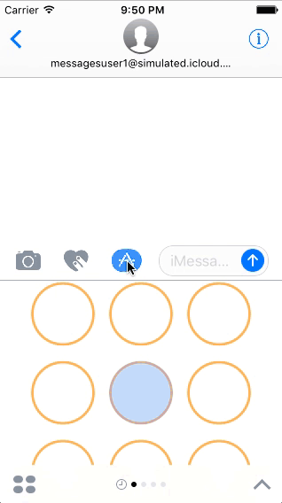

# TicTacToe
iOS 10 Messages App TicTacToe Game. 

## What is it?
This project uses iOS 10's iMessage app feature to create a two-player n-sized TicTacToe game. The game was finished less than a week after Apple announced their new Messages framework.
####Features:
* Matrix operations (diagonal & antidiagonal traversing)
* OOP & MVC
* Search algorithms

## TODO:
* Multiplayer TicTacToe.
* Point system TicTacToe: whoever has the most winning solutions (ex. three in a row) wins.

### Beta note: 
Because iOS 10 is still in beta, some game behaviors may not function as expected. If you notice any strange behavior, please submit an issue.